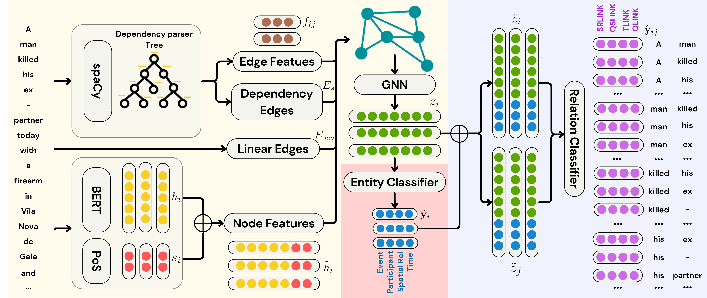

# NarrGraph

**A Framework for Semantic Graph Extraction from Narrative Texts**

NarrGraph, a framework for extracting semantic graphs from narratives that jointly learns and infers semantic graphs from narrative texts by integrating temporal, referential, spatial and thematic layers of information that can be used for information extraction, knowledge discovery, and narrative analysis.

---

# Methodology

Given an input sequence of tokens, the model predicts entity labels at the token level and semantic relations between candidate pairs of tokens. The following provides an overview of the NarrGraph architecture.

 

The model architecture consists of three main components: 

1. In the yellow box input tokens are mapped to contextualized embeddings using a BERT encoder. These embeddings are then refined through a Graph Neural Network (GNN), allowing information to propagate along syntactic dependency edges and through the token sequence linear order. 
2.  In the red box, the resulting node embeddings are used to predict token-level entity labels. 
3. In the blue box, the model predicts the edges by representing candidate relations through the concatenation of embeddings of token pairs `(i,j)`, augmented with the predicted entity information. 

## Annotation Framework
NarrGraph was trained to extract the following entities and link strctures wihtch correspond to the nodes and edges of the extracted graph :

#### Entity Structures

- **Events:** Eventualities that occur or states/circumstances that are temporally relevant, i.e., directly related to a temporal expression or changing over the course of the text. Events include main verbs, aspectual verbs, predicative constructions, and event-denoting nouns or adjectives.

- **Participants:** Named entities or participants (including locations) that play a key role in an event or state.

- **Times:** Temporal expressions that represent time units anchoring events in time e.g., specific dates, times or durations.

    
- **Spatial Relations:** Textual fragments that introduce locations or movement, including prepositions and adverbs (e.g., `in`, `to`, `near`). Note that these are entities annotated at the text span level, not relational links between entities.

#### Link Structures

- **Semantic Role Links (SRLINK):** These links identify how an entity is involved/participates in an event or eventuality. These links connect events to participants or events to events when the latter function as arguments.
    
- **Temporal Links (TLINK):** Establishes temporal relationships (simultaneous, after, before) between two events, two times, or between an event and a time.

- **Qualitative Spatial Links (QSLINK):** Qualitative spatial relations linking a Figure (the entity being located) to a Ground (the reference location). These links connect events to Spatial\_Relations or Spatial\_Relations to participants. 

- **Objectal Links (OLINKs):** Referential or coreferential relations between entities. These links connect Participants to Participants, Spatial\_Relations to Spatial\_Relations, or across these entity types.

---

## Dataset

For reproducibility, the LUSA dataset used in the paper was attached to the paper submission. The dataset is also openly available at [https://rdm.inesctec.pt/dataset/cs-2023-018](https://rdm.inesctec.pt/dataset/cs-2023-018).

---

## License & Ethics

* For **research and educational purposes only**.
* Do not apply to **private, sensitive, or confidential documents**.
* Ensure responsible use, especially when working with news or personal data.

